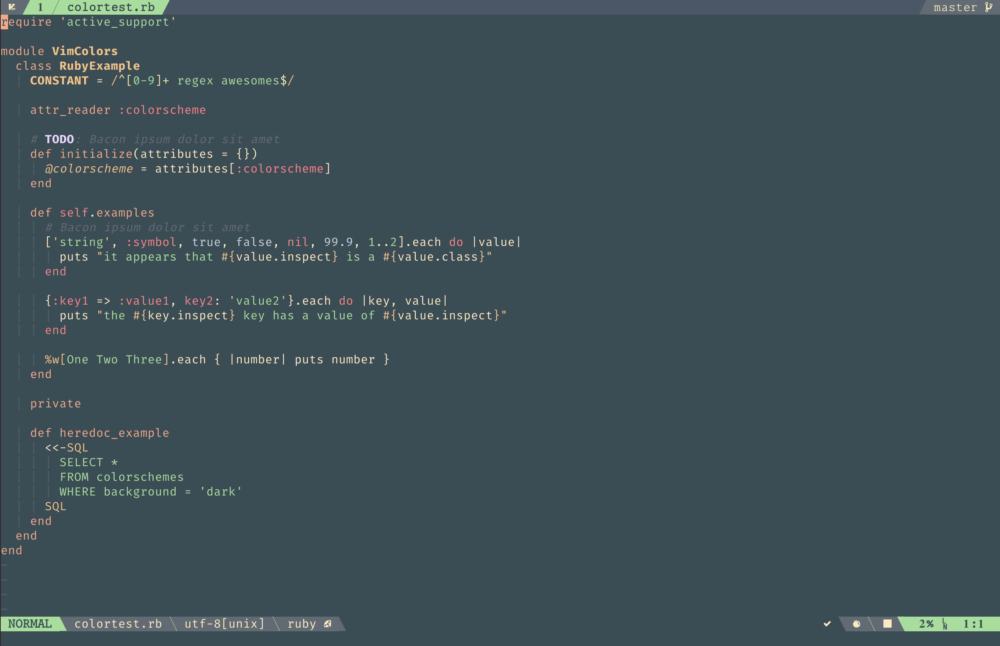

# Demo



You can preview it over here:

[vimcolors.com](http://vimcolors.com/905/forest-night/dark)

[vivify](http://bytefluent.com/vivify/index.php?remote=github.com%2Fsainnhe%2Fvim-color-forest-night%2Fraw%2Fmaster%2Fcolors%2Fforest-night.vim)

# Installation

for [vim-plug](https://github.com/junegunn/vim-plug)

```vim
Plug 'sainnhe/vim-color-forest-night'
```

# Usage

```vim
colorscheme forest-night
```

To enable [lightline](https://github.com/itchyny/lightline.vim) color scheme, put this in your vimrc

```vim
let g:lightline.colorscheme = 'forest_night'
```

or if you want to apply it without reload

```vim
:let g:lightline.colorscheme = 'forest_night'
:call lightline#init()
:call lightline#colorscheme()
:call lightline#update()
```

# Customize

As most of codes are from **[spring-night](https://github.com/rhysd/vim-color-spring-night)**, you can customize some behaviors of this colorscheme just like [this](https://github.com/rhysd/vim-color-spring-night#customize)

- `g:forest_night_kill_italic`: If `1`, this colorscheme does not use italic attribute. Default value is `0`.

- `g:forest_night_kill_bold`: If `1`, this colorscheme does not use bold attribute. Default value is `0`.

- `g:forest_night_high_contrast`: If `1`, it uses a bit high contrast colors. Default value depends on termguicolors option and whether on GUI or CUI Vim is running.

- `g:forest_night_highlight_terminal`: If `1`, a terminal window is also highlighted with this color scheme. Otherwise default ANSI colors are used. Default value is `1`.

- `g:forest_night_cterm_italic`: If `1`, italic font is enabled even in a terminal. This variable is useful when your terminal supports italic fonts. Default value is `0`.

# Inspirations

**[spring-night](https://github.com/rhysd/vim-color-spring-night)** (most of codes are from here)

**[sacredforest](https://github.com/KKPMW/sacredforest-vim)**
