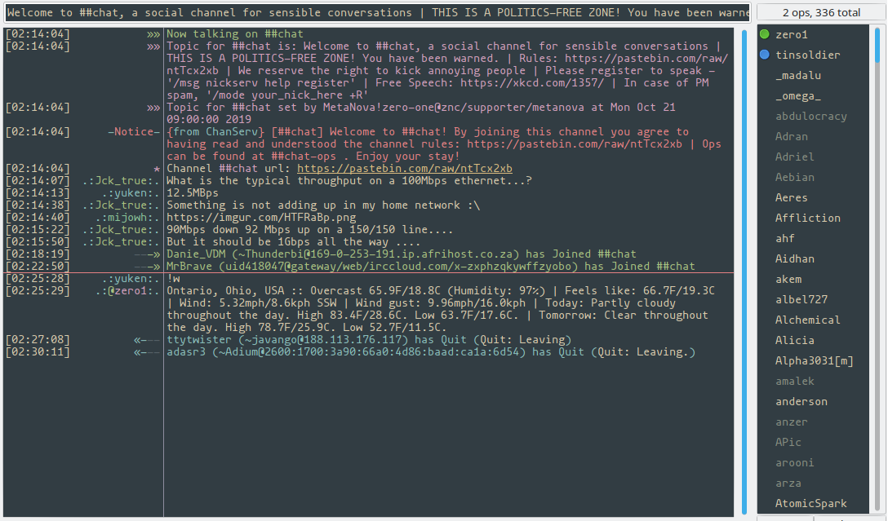

# Forest Night - HexChat

## Install

- Download [`forest-night.hcl`](https://raw.githubusercontent.com/sainnhe/forest-night/master/hexchat/forest-night.hcl)
    - These are just simply ZIP archives that you can extract manually into your config folder with HexChat closed
- If you're on Windows, HexChat comes with a Theme Manager than you can install with the file.
- Otherwise, unzip the `forest-night.hcl` and place the contents inside `~/.config/hexchat`
