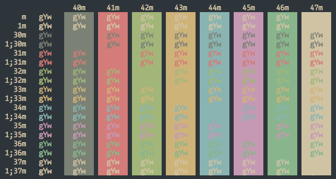

# Forest Night iTerm Theme

## Install

Download [`forest-night.itermcolors`](https://raw.githubusercontent.com/sainnhe/forest-night/master/iterm/forest-night.itermcolors) and save it.

Open iTerm and go to **Preferences** (<kbd>Cmd</kbd>+<kbd>,</kbd>) > **Colors** > **Color Presets...** > **Import...** and select `forest-night.itermcolors`.
