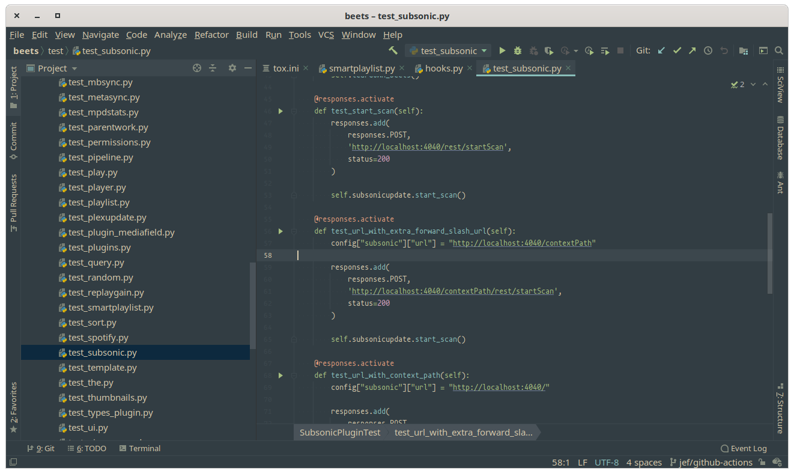

# Forest Night - JetBrains

## Install

Download from the [JetBrains Marketplace](https://plugins.jetbrains.com/plugin/14448-forest-night).

## Contributing

To work with the plugin, add a **New Module** to the **Project Structure** using the **IntelliJ Platform Plugin SDK**. Set the location to the `jetbrains` folder. Changes should be now editable live via `Forest_Night.theme.json`.

After changes are complete, please bump `<version>1.0.0</version>` in `plugin.xml` by major, minor, or patch depending on the change.

### Credits

Thanks to [Artic Ice Studio's Nord Theme](https://github.com/arcticicestudio/nord-jetbrains) for creating a fantastic foundation to build on.