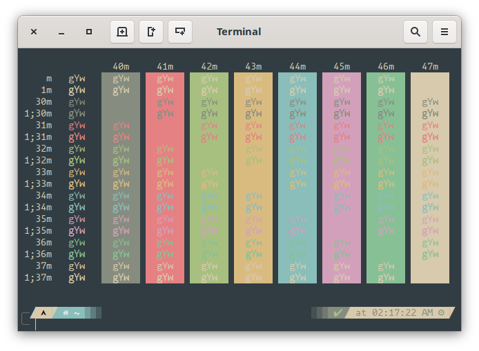

# Forest Night Tilix

## Install

Download [`forest-night.json`](https://raw.githubusercontent.com/sainnhe/forest-night/master/tilix/forest-night.json) and save it to `/usr/share/tilix/schemes/forest-night.json` or `~/.config/tilix/schemes/forest-night.json`

- Open Tilix and go to **Preferences** > **Profiles** > **Color...**
- Select `forest-night` from **Color scheme** drop down
